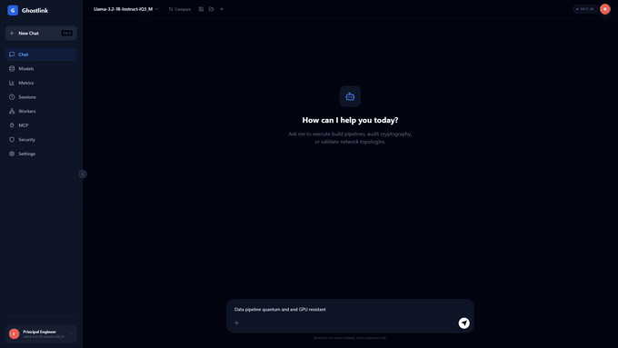

<div align="center">

# 👻 Ghostlink

**Distributed inference fabric for custom LLM systems.**
Route workloads across CPU, GPU, and NPU resources with explicit scheduling, hardware-aware placement, and a self-hosted open-source stack.

[](https://github.com/rwilliamspbg-ops/Ghostlink/actions/workflows/ci.yml)
[](https://github.com/rwilliamspbg-ops/Ghostlink/actions/workflows/tests.yml)
[](https://github.com/rwilliamspbg-ops/Ghostlink/actions/workflows/security.yml)
[](https://github.com/rwilliamspbg-ops/Ghostlink/actions/workflows/msrv.yml)
[](LICENSE)
[](https://rwilliamspbg-ops.github.io/Ghostlink/)
[](CHANGELOG.md)
[](Cargo.toml)
[](#quick-start)
[](CONTRIBUTING.md)
[](https://github.com/rwilliamspbg-ops/Ghostlink)
[](https://github.com/sponsors/rwilliamspbg-ops)

[Quick Start](#quick-start) · [Demo](#demo) · [Architecture](#architecture) · [API](#api-endpoints) · [Docs](https://rwilliamspbg-ops.github.io/Ghostlink/) · [Contributing](CONTRIBUTING.md)

</div>

---

## Demo

**Install → load a model → chat**, end to end, running [Llama 3.2 1B](https://huggingface.co/meta-llama/Llama-3.2-1B-Instruct) locally through Ghostlink Studio's native llama.cpp backend.



> The full-length recording (with audio) lives in the gitignored `demo/` folder for local viewing — it's not part of the pushed repo, so there's no link to it here.

## Table of Contents

- [What Ghostlink brings](#what-ghostlink-brings)
- [Why Ghostlink](#why-ghostlink)
- [Quick Start](#quick-start)
- [Hardware Detection & Compatibility](#hardware-detection--compatibility)
- [Comparison vs. Other Platforms](docs/COMPARISON.md)
- [Performance](#performance)
- [Launch Scripts](#launch-scripts)
- [Usage (Developer)](#usage-developer)
- [MCP Tools](#mcp-tools-model-context-protocol)
- [Editor Tab & Copilot Features](#editor-tab--copilot-features)
- [Troubleshooting](#troubleshooting)
- [Environment Variables](#environment-variables)
- [Architecture](#architecture)
- [Testing](#testing)
- [Project Status](#project-status)
- [Contributing](#contributing)
- [License](#license)

## What Ghostlink brings

- Clear routing and scheduling for custom inference topologies
- Real cross-machine distributed inference: opt in a node's spare GPU/CPU and
  a request automatically splits across it via llama.cpp's own RPC backend —
  zero-config, no manual `--rpc` flags
- Hardware-aware placement across mixed compute environments (CPU, GPU, NPU)
- SPSC ring-buffer transport with spin-wait for sub-microsecond handoff
- TCP and Unix domain socket transport for multi-process pipelines
- Session-level authentication on transport frames
- Dynamic system profile watching with auto-tuning cache
- In-GUI code editor (Monaco) with copilot-style actions — Explain/Fix/Refactor
  with diff preview before anything is written, multi-file refactor, opt-in
  ghost-text autocomplete, and repo-aware chat via local RAG indexing
- A strong open-source foundation with a commercial support path

## Why Ghostlink

Point Ghostlink at every machine on your LAN and it becomes one inference
cluster — correctly sized, authenticated, and observable — with zero YAML
and no manual `--rpc` flags. Nobody else combines *zero-config discovery of
heterogeneous consumer/prosumer hardware* (gaming GPU + old laptop +
NPU-equipped ultrabook + Mac) with *real distributed inference across it*:
vLLM assumes a homogeneous co-located GPU fleet, Ollama and LM Studio don't
distribute at all, and Kubernetes-based serving solves this but needs a
cluster and an ops team. See [docs/COMPARISON.md](docs/COMPARISON.md) for
the full breakdown and [docs/BENCHMARKS.md](docs/BENCHMARKS.md) for a real
two-machine LAN run backing this up, not just prose.

Use Ghostlink when you need:
- zero-config cluster formation across mixed CPU/GPU/NPU hardware already
  sitting on your network,
- a self-hosted inference fabric with open-source flexibility and no
  vendor lock-in,
- a platform that can be extended into a paid commercial offering with
  support and enterprise deployment services.

## Quick Start

Three commands, one launcher, no manual service wiring — `launch.bat` / `launch.sh` builds what's missing, starts every process, and opens the GUI.

### Windows

**Prerequisites**

| Tool | Required | How to Install |
|------|----------|---------------|
| **Rust** | Yes | `winget install Rustlang.Rustup` or https://rustup.rs |
| **Node.js** | Yes | `winget install OpenJS.NodeJS.LTS` or https://nodejs.org (LTS) |
| **CMake** | For llama.cpp | `winget install Kitware.CMake` or https://cmake.org/download/ |
| **Git** | For llama.cpp | `winget install Git.Git` |

**Clone and launch**

```powershell
git clone https://github.com/rwilliamspbg-ops/Ghostlink.git
cd Ghostlink

# One-time backend build (if target\release\ghost-link.exe is missing, launch.bat builds it)
cargo build --release -p ghost-link

# Single launcher for the full stack
.\launch.bat
```

This starts:
- **llama-server** (inference, port **8080**)
- **Ghostlink API** (chat / models / settings, port **8003**) — internal; the GUI does not call this directly
- **Control-plane** (Go gateway: CORS, request logging, rate limiting, streaming-safe proxy, port **8000**) — GUI must use this port
- **React frontend** at http://127.0.0.1:5173, opened automatically in your browser

**Verify it's actually running** (skip if the browser tab already loaded cleanly):
```powershell
curl http://127.0.0.1:8000/health   # control-plane — GUI-facing gateway
curl http://127.0.0.1:8003/health   # ghost-link API — should agree with the line above
```
Both should return a JSON body with a healthy status, not a connection error.

Open http://127.0.0.1:5173 → **Models** → load a model (a small one like `Llama-3.2-1B-Instruct` loads in seconds and is a good first check) → **Chat**.

Optional:
```powershell
# Ollama instead of llama-server
$env:GHOSTLINK_INFERENCE_BACKEND="ollama"; .\launch.bat

# Fall back to the old WSL-delegated launcher (runs launch.sh inside WSL)
$env:GHOSTLINK_USE_WSL="1"; .\launch.bat
```

> **405 on chat/models?** The GUI was pointed at the wrong port (e.g. ghost-link `:8003` directly, or llama-server `:8080`). Always use API base `http://127.0.0.1:8000` (the control-plane gateway).
>
> **Chat suddenly errors with "error sending request for url (...8080...)"?** `llama-server` died — usually from two model-load requests overlapping (double-clicking Load, switching models fast). Fixed in 1.7.1+; if you're still seeing it, `Unload` then re-`Load` the model from the Models tab.

### Linux / macOS

**Prerequisites**: Rust, Node.js, curl; cmake optional (a prebuilt `llama-server` is used as a fallback if cmake isn't available).

```bash
git clone https://github.com/rwilliamspbg-ops/Ghostlink.git
cd Ghostlink
cargo build --release -p ghost-link
./launch.sh
# launch-complete.sh is a thin wrapper around launch.sh
```

Same verification and port layout as Windows above — `curl http://127.0.0.1:8000/health`, then http://127.0.0.1:5173 → **Models** → **Chat**.

### Docker (all platforms)

No Rust/Node/cmake toolchain needed — just Docker.

```bash
git clone https://github.com/rwilliamspbg-ops/Ghostlink.git
cd Ghostlink
mkdir -p models
curl -L -o models/stories15M-q4_0.gguf https://huggingface.co/ggml-org/models/resolve/main/tinyllamas/stories15M-q4_0.gguf
docker compose up --build
```

Then open http://localhost:5173 → **Models** → **Chat**. Swap `models/stories15M-q4_0.gguf` (and the `llama-server` volume mount in [docker-compose.yml](docker-compose.yml)) for a larger GGUF once you've confirmed the stack comes up.

> `docker-compose.demo.yml` is an older prototype (Python model manager + Ollama) and is no longer maintained — use `docker-compose.yml` above.

## Hardware Detection & Compatibility

Ghostlink auto-detects available accelerators at startup by probing in this order: `nvidia-smi` (cross-platform), then an OS-specific fallback (Windows WMI / Linux lspci+sysfs / macOS `system_profiler`), then a Vulkan probe as a last resort. What's actually detectable, per OS (grounded in [`system_profile.rs`](crates/ghostlink-core/src/system_profile.rs)):

| Accelerator | Windows | Linux | macOS | Detection |
|---|:---:|:---:|:---:|---|
| **CUDA** (NVIDIA) | ✅ | ✅ | ⚠️¹ | `nvidia-smi`, `CUDA_PATH` |
| **DirectML** (AMD iGPU, Intel ARC, any DX12 GPU) | ✅ | ❌ | ❌ | WMI |
| **ROCm** (AMD discrete) | ❌ | ✅² | ❌ | `rocm-smi`, `hipconfig` — needs `--features rocm` |
| **Vulkan** (generic GPU fallback) | ✅ | ✅ | ✅ | Vulkan probe, full-scan mode only |
| **Metal** (Apple Silicon) | ❌ | ❌ | ✅ | `sysctl hw.optional.arm64` |
| **NPU** (AMD XDNA, Intel NPU, Qualcomm) | ✅ | ✅ | ✅³ | WMI (Windows), sysfs/`/sys/class/accel` (Linux), Apple Neural Engine (macOS) |
| **AF_XDP kernel bypass** | ❌ | ✅ | ❌ | Linux-only transport optimization ([`xdp.rs`](crates/ghostlink-core/src/xdp.rs)) |
| **CPU** | ✅ | ✅ | ✅ | Always available — the guaranteed fallback |

¹ NVIDIA GPU support on macOS has been effectively deprecated by both Apple and NVIDIA for years — the probe runs, but don't expect it to find anything on real hardware.
² ROCm detection is compiled out entirely unless you build with `cargo build --features rocm`; without it, AMD discrete GPUs on Linux fall through to the Vulkan probe.
³ Detected as the Apple Neural Engine, not a discrete accelerator — no VRAM/memory figure is reported since it shares system memory.

**Backend support** (native `llama-server` vs. Ollama): both work identically on all three OSes — Ollama just needs the `ollama` binary on `PATH` (`GHOSTLINK_INFERENCE_BACKEND=ollama`), no build changes required.

If your GPU isn't detected, set env vars manually:
```powershell
$env:GHOSTLINK_GPU_NAME="AMD Radeon 860M"
$env:GHOSTLINK_VRAM_GB=8
$env:GHOSTLINK_COMPUTE_CAPABILITY="gpu"
```

A full hardware probe (spawning several external commands: PowerShell/CIM
queries on Windows, `nvidia-smi`, etc.) runs concurrently rather than
sequentially — measured at ~1.4s on a Windows dev machine, down from ~4s when
these ran one after another with no shared state between them.

## Performance

Sub-microsecond core primitives drive Ghostlink's distributed inference fabric. Benchmarks
run on an **Intel i7-14700K (Linux/WSL2)** with `RUSTFLAGS="-C target-cpu=native"`.

### Microbenchmarks

| Benchmark | Latency | Throughput |
|-----------|---------|-----------|
| Ring buffer push+pop (single-thread) | 1.94 ns | 516 M ops/s |
| Ring buffer SPSC cross-thread (100k) | 10.67 ns | 93.7 M ops/s |
| Protocol: DiscoveryFrame encode | 75.80 ns | 13.2 M ops/s |
| Protocol: DiscoveryFrame decode | 126.82 ns | 7.9 M ops/s |
| Protocol: encode + decode round-trip | 196.46 ns | 5.1 M ops/s |
| Planning: 33 layers / 2 nodes | 115.46 ns | 8.7 M ops/s |
| Planning: 80 layers / 8 nodes | 245.31 ns | 4.1 M ops/s |
| Planning: autotuned (80 layers, 8 nodes) | 360.99 ns | 2.8 M ops/s |
| Cluster: register node | 193.04 ns | 5.2 M ops/s |
| Cluster: snapshot (10 nodes) | 533.40 ns | 1.9 M ops/s |
| Autotune: detect runtime profile | 166.58 ns | 6.0 M ops/s |

### Pipeline Throughput

| Transport | Tokens / batch | Throughput | Latency |
|-----------|---------------|-----------|---------|
| In-process (spin-wait) | 1024 / 128 | 900 K tok/s | 1.14 ms |
| TCP loopback | 1024 / 128 | 340 K tok/s | 3.01 ms |
| In-process (spin-wait) | 256 / 32 | 639 K tok/s | 0.40 ms |
| TCP loopback | 256 / 32 | 236 K tok/s | 1.08 ms |

These four numbers move a 64-byte/token synthetic payload — a stand-in
roughly 128x smaller than a real model's per-token activation, so treat
this table as a transport-layer ceiling, not an LLM-workload number. For
realistic payload sizes (4K-32K token batches at real FP16/BF16 activation
byte sizes, P99 latency, bandwidth GB/s, and a Ray actor-transfer
comparison baseline), see
[docs/BENCHMARKS.md's "LLM-Shaped Workload Benchmarks"](docs/BENCHMARKS.md#llm-shaped-workload-benchmarks--2026-08-05)
section.

### Reproduce these numbers / other hardware

```bash
cargo bench -p ghostlink-core --bench criterion   # microbenchmarks
python scripts/flow_perf_snapshot.py --exec-tokens 512 --micro-batch 8 --runs 5 --modes tcp inmem --release
```

Note: the `flow` command's TCP/XDP paths can now carry a realistic
per-token payload — opt-in via `GHOSTLINK_FLOW_HIDDEN_DIM`/`GHOSTLINK_FLOW_DTYPE_BYTES`
(e.g. `4096`/`2` for a 7B-class FP16/BF16 model), not the default. The
command above still reproduces the legacy Pipeline Throughput table's
64-byte/token numbers unchanged; see the LLM-Shaped section linked above for
the exact reproduce command with those env vars set.

Every number above is falsifiable — run the commands yourself. Numbers vary
meaningfully by hardware: [docs/BENCHMARKS.md](docs/BENCHMARKS.md) documents
two more full profiles with the same rigor — an AMD Radeon 860M integrated
GPU laptop (Windows) and a 4-core Linux mini PC with no dedicated GPU —
including honest noisiness notes for both low-power classes. A first real
multi-node LAN run (that same Windows laptop and Linux mini PC, over a real
network) is also in BENCHMARKS.md's Multi-Node Performance section; more
node counts and hardware pairs (especially discrete GPUs) are still open,
see [docs/ROADMAP.md](docs/ROADMAP.md), Horizon 1.

### Local llama-server tuning

Native nodes enable Flash Attention, VRAM-scaled batch sizes, and Q8_0 KV cache by default. Prefer **Q4_K_M** / **IQ4_XS** over FP16/Q8_0 for ~1.5–2× decode speed. Override with `GHOSTLINK_LLAMA_SERVER_ARGS`. See [docs/LOCAL_INFERENCE_TUNING.md](docs/LOCAL_INFERENCE_TUNING.md).

GPU layer offload (`-ngl`) is now always passed explicitly to `llama-server`,
including the "auto-detect" case (`-ngl -1`, let llama-server decide) when no
VRAM/GPU is detected or the corresponding env vars aren't set. Previously the
flag was omitted entirely in that case, and llama-server's own default
(`-ngl` absent) is CPU-only — meaning inference silently ran on CPU with no
GPU offload and no warning on any launch path that didn't set
`GHOSTLINK_VRAM_GB`/`GHOSTLINK_LLAMA_NGL` itself.

Compiling with `RUSTFLAGS="-C target-cpu=native"` further improves performance by enabling CPU-specific instruction sets (opt-in; not set by default — a multi-node cluster can't assume every node shares one CPU microarchitecture).

### Build profile

Release builds use `lto = "thin"` and `codegen-units = 1` (`[profile.release]` in the workspace `Cargo.toml`) so the compiler can inline across the `ghostlink-core` / `ghost-link` crate boundary — the ring buffer, protocol, and planning hot paths all cross it. A same-machine, same-run A/B (not the table above, which is a different machine/OS) showed the deterministic single-threaded paths 6–19% faster with this profile; thread-scheduling-bound benchmarks were noisier and not clearly attributable to it either way. `panic = "abort"` was considered and deliberately not set, since it would crash the whole server process on any panic instead of failing just one request.

## Launch Scripts

| Script | Description |
|--------|-------------|
| `launch.bat` | **Windows** — native launcher (llama-server + API :8003 + control-plane gateway :8000 + GUI :5173, no WSL). Set `GHOSTLINK_USE_WSL=1` to use `launch.sh` inside WSL instead. |
| `launch-native.ps1` | The actual native-Windows implementation `launch.bat` calls into |
| `launch.sh` | **Linux/macOS** — same stack with hardware detection |
| `launch-complete.bat` / `launch-complete.sh` | Compatibility wrappers → `launch.bat` / `launch.sh` |
| `launch-ollama.bat` | Thin wrapper setting `GHOSTLINK_INFERENCE_BACKEND=native` (both bat and ps1 launchers respect it; set `GHOSTLINK_INFERENCE_BACKEND=ollama` yourself for Ollama) |

## Usage (Developer)

### CLI Commands

```bash
# Build
cargo build --release -p ghost-link

# With AMD ROCm support
cargo build --release -p ghost-link --features rocm

# Probe local hardware profile (with auto-tuning cache)
cargo run -p ghost-link -- probe my-node
cargo run -p ghost-link -- probe my-node --full

# Generate a placement plan for your hardware
cargo run -p ghost-link -- plan

# Start the OpenAI-compatible API server
cargo run -p ghost-link -- serve 127.0.0.1 8003

# Unified troubleshooting
cargo run -p ghost-link -- doctor --strict

# Run the full 30B planning flow
cargo run -p ghost-link -- flow iprada-16gb zenbook-32gb 32 32 64 4 tcp

# Launch the ASCII cluster dashboard
cargo run -p ghost-link -- dashboard
```

### API Endpoints

Every route below except `/health` requires `Authorization: Bearer <token>` —
either the API key printed once at server startup (also saved to
`api_key.txt`), or a short-lived JWT exchanged for it via
`POST /api/security/jwt/refresh`. See [docs/API_REFERENCE.md](docs/API_REFERENCE.md)
for full request/response examples and [docs/openapi.yaml](docs/openapi.yaml)
for a machine-readable spec.

| Endpoint | Method | Description |
|----------|--------|-------------|
| `/health` | GET | Health check (no auth required) |
| `/v1/chat/completions` | POST | OpenAI-compatible chat completion |
| `/v1/completions` | POST | OpenAI-compatible legacy (prompt-based) completion |
| `/v1/embeddings` | POST | OpenAI-compatible embeddings (Ollama backend only) |
| `/v1/models` | GET | OpenAI-compatible model list |
| `/api/models` | GET | List available models |
| `/api/models/status` | GET | Loaded model status |
| `/api/runtime/detect` | GET | Available runtimes (GPU, NPU, CPU) |
| `/api/runtime/models?runtime=directml` | GET | Models filtered by runtime |
| `/api/backends` | GET | Current backend + available backends |
| `/api/backends/switch` | POST | Switch inference backend |
| `/api/backends/:name/status` | GET | Status for one specific backend |
| `/api/metrics` | GET | Performance metrics |
| `/api/inference/chat` | POST | Chat completion |
| `/api/models/partial` | GET | List interrupted downloads (`.gguf.part` files) |
| `/api/models/partial/discard` | POST | Delete an interrupted download |
| `/api/security/jwt/refresh` | POST | Exchange the API key for a short-lived JWT |
| `/api/security/pqc/state` | GET | Whether this running server is serving HTTPS/PQC-hybrid TLS |
| `/api/security/pqc/enable` | POST | Persist `enable_tls: true` (takes effect on next restart) |
| `/api/security/audit-log` | GET | Security audit log entries (failed auth, JWT refresh, PQC enable, tool-call approve/deny — last 500, most recent first) |
| `/api/workspace/tree` | GET | List a directory under the Editor tab's workspace root (`?path=`) |
| `/api/workspace/file` | GET / PUT | Read or write a workspace file (`?path=` / `{path, content}`) — both reject any path that escapes the workspace root |
| `/api/workspace/index` | POST | Index the workspace into the `rag` MCP server for repo-aware chat context; `"skipped"` if `rag`/Ollama isn't reachable |
| `/metrics` | GET | Prometheus-exposition-format metrics (same data as `/api/metrics`) |

### Python client

A Python client package lives at [`sdks/python`](sdks/python) — wraps the OpenAI-compatible endpoints plus native token-streaming chat, workers, metrics, and settings. See [sdks/python/README.md](sdks/python/README.md).

```python
from ghostlink_client import GhostlinkClient

client = GhostlinkClient("http://127.0.0.1:8003", api_key="<your api key>")
resp = client.chat.completions.create(model="llama3.2:3b", messages=[{"role": "user", "content": "hi"}])
print(resp.content)
```

## MCP Tools (Model Context Protocol)

Ghostlink chat can call real tools via [MCP](https://modelcontextprotocol.io) servers,
configured in `mcp_servers.toml` (a gitignored, per-install copy of
`mcp_servers.example.toml`, auto-created on first run — same pattern as
`ghostlink.toml`/`ghostlink.example.toml`).

Default servers:

| Chat tool slot | Backing server | Enabled by default |
|---|---|---|
| `file_operations` | `@modelcontextprotocol/server-filesystem` (npx) | ✅ |
| `api_call` | `mcp-server-fetch` (uvx) | ✅ |
| `calculator` | `mcp-calculator` (this repo, `evalexpr`-backed) | ✅ |
| `database_query` | `mcp-server-sqlite` (uvx) | ✅ |
| `web_search` | `@modelcontextprotocol/server-brave-search` (npx) | needs `BRAVE_API_KEY` |
| `code_execution` / `terminal` | Docker MCP Toolkit gateway | needs Docker Desktop running |
| `image_generation` | *(not yet configured — no default backend picked)* | ❌ |
| — | `sequential-thinking` (npx) | ✅ |
| — | `vision` (this repo, wraps local Ollama) | needs a pulled vision model |
| — | `rag` (this repo — `index_document`/`search`, local Ollama embeddings + brute-force cosine index, no external vector DB) | ✅ (needs a pulled embedding model, e.g. `nomic-embed-text` — the Editor tab's auto-index degrades to a no-op `"skipped"` if Ollama isn't reachable) |

The model decides whether and which tool to call (a ReAct-style prompt works
with any local GGUF/Ollama model; Ollama models whose chat template declares
native tool-calling support use that automatically instead). Tools marked
`requires_confirmation` in `mcp_servers.toml` (terminal, code_execution) pause
for explicit user approval before executing — see the MCP tab in the GUI.

Requires `npx`/`node` (bundled MCP servers) and `uvx`/`python` (Python-distributed
ones) on `PATH`; Docker Desktop for the terminal/code_execution slots.

## Editor Tab & Copilot Features

Ghostlink Studio's **Editor** tab is a Monaco-based code editor over the
running server's real filesystem (`/api/workspace/*`, confined to a
canonicalized workspace root — no path traversal outside it), separate from
the sandboxed `file_operations` MCP tool above.

- **Browse, open, and save** any file under the workspace root, with syntax
  highlighting per extension.
- **Explain / Fix / Refactor** — scoped to the current selection, or the
  whole file if nothing's selected. Fix/Refactor render their proposed change
  as a side-by-side diff (Monaco's `DiffEditor`) with explicit Accept/Reject
  — nothing is written to disk until you accept it.
- **Multi-file refactor** — select several files in the tree, send them in
  one prompt, then step through each proposed change individually
  (Accept/Reject/Skip).
- **Ghost-text autocomplete** (opt-in, via the lightning-bolt toggle) —
  Monaco's native inline-completion UI, driven by the same chat-completion
  endpoint as everything else here. Not true fill-in-the-middle (no suffix
  awareness, no model-specific FIM tokens) — a real network+inference round
  trip on a debounce, not per-keystroke-fast.
- **Repo-aware chat context** — on first load, the Editor tab feeds the
  workspace into the `rag` MCP server (enabled by default; needs a pulled
  Ollama embedding model) so chat can pull in relevant file content without
  anyone calling `index_document` by hand. Re-indexing a file replaces its
  prior chunks rather than duplicating them.

## Troubleshooting

### Ollama 404 on /api/generate

If Ollama logs show `POST /api/generate` returning `404`:

1. Check installed tags: `ollama list`
2. Verify tags through API: `curl http://127.0.0.1:11434/api/tags`
3. Pull the exact tag: `ollama pull qwen2.5:3b`
4. Select that exact tag in Ghostlink before sending chat requests.
5. If logs show device visibility overrides: `setx HSA_OVERRIDE_GFX_VERSION ""`
6. Restart Ollama and Ghostlink after model or environment changes.

### Port Conflicts

Launch scripts check for port conflicts before binding. If you see "address already in use", ensure no stale processes are holding ports 8000, 8003, or 8080.

## Environment Variables

| Variable | Default | Description |
|----------|---------|-------------|
| `GHOSTLINK_INFERENCE_BACKEND` | `native` | `native` or `ollama` |
| `GHOSTLINK_NATIVE_ENGINE` | `llama_server` | `llama_server` or `llama_cpp` |
| `GHOSTLINK_LLAMA_SERVER_URL` | `http://127.0.0.1:8080/completion` | llama-server URL |
| `GHOSTLINK_GPU_NAME` | — | Override detected GPU name |
| `GHOSTLINK_VRAM_GB` | — | Override detected VRAM |
| `GHOSTLINK_COMPUTE_CAPABILITY` | — | Override detected compute capability |
| `GHOSTLINK_RUNTIME` | — | Force a runtime selection |
| `GHOSTLINK_FORCE_RUNTIME` | `false` | When `true`, honor `GHOSTLINK_RUNTIME` even if not auto-detected |
| `GHOSTLINK_SYSTEM_MEMORY_GB` | — | Override detected system memory |
| `NPU_DEVICE` / `QUALCOMM_NPU` | — | Enable NPU detection via env |

### Config File (TOML)

See `ghostlink.toml` for all settings:
- Node identities and resource overrides
- Discovery broadcast configuration
- TCP transport tuning (max_inflight, auth_token, reconnect)
- GUI Python path

## Architecture

See [docs/ARCHITECTURE.md](docs/ARCHITECTURE.md) for a request/cluster-flow diagram.

```
crates/
├── ghostlink-core/         # Shared runtime primitives
│   ├── ring.rs              # SPSC lock-free ring buffer (spin-wait)
│   ├── runtime.rs           # Pipeline execution (in-memory, TCP, Unix, AF_XDP)
│   ├── system_profile.rs    # Cross-platform GPU/NPU/CPU auto-detection
│   ├── autotune.rs          # Auto-tuning cache with hardware fingerprinting
│   ├── watcher.rs           # Dynamic hot-plug system profile watcher
│   ├── host.rs              # Compute host summary
│   ├── planning.rs          # Layer assignment & quantization
│   ├── protocol.rs          # Binary frame protocol with CRC32 + HMAC auth
│   ├── discovery.rs         # UDP broadcast cluster discovery
│   ├── mdns.rs              # mDNS cluster discovery (VLAN/VPC-friendly)
│   ├── cluster.rs           # Thread-safe node state & metrics
│   ├── health.rs            # Network health & fault detection
│   ├── load_balance.rs      # Tensor distribution across nodes
│   ├── accelerator.rs       # NPU acceleration detection
│   └── xdp.rs               # AF_XDP kernel bypass (fallback-safe)
├── ghost-link/              # CLI demo & API server
│   └── src/mcp/              # MCP client (rmcp): registry, config, tool-calling loop
├── mcp-calculator/          # Custom MCP server backing the calculator chat tool
├── mcp-vision/              # Custom MCP server backing the vision chat tool (local Ollama)
ghostlink_gui_modern/        # React frontend (Vite + Tailwind)
```

## Testing

```bash
# Full test suite
cargo test --workspace

# With ROCm feature
cargo test --workspace --features rocm

# Run benchmarks
cargo bench --package ghostlink-core
```

### Pre-Push Checklist

Before pushing to CI, run:
```bash
cargo fmt --all --check
cargo clippy --workspace --all-targets -- -D warnings
cargo test --workspace
```

CI enforces the same checks across Ubuntu, Windows, and macOS.

## Project Status

Ghostlink is positioned as a launch-ready open-source foundation with a strong demo story and public-facing collateral.

Current strengths:
- a working local launch path for experimentation and demos,
- a clear positioning around distributed inference scheduling and routing,
- public assets for comparison, demo flow, and product storytelling.

Current focus areas:
- strengthening the end-to-end demo experience,
- improving documentation for deployment and production use,
- expanding real-world validation across more hardware and runtime setups.

**Public launch assets:**
- Live site: https://rwilliamspbg-ops.github.io/Ghostlink/
- Comparison sheet: [docs/COMPARISON.md](docs/COMPARISON.md)
- Demo flow: [docs/archive/launch_demo.md](docs/archive/launch_demo.md)

## Contributing
See [CONTRIBUTING.md](CONTRIBUTING.md) for setup, PR expectations, and release rubric.
See [CONTRIBUTORS.md](CONTRIBUTORS.md) to see who's built this so far.

## License
MIT
