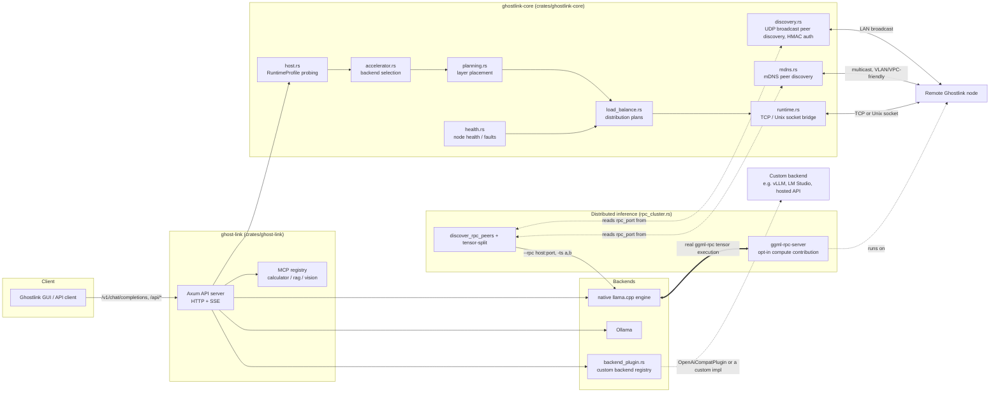

# Ghost-Link Architecture

## Overview

Ghost-Link is a Rust workspace for low-overhead cluster discovery, host profiling, planning, and load distribution across local compute nodes.

## Request & Cluster Flow



## Workspace Structure

```text
Ghostlink/
├── crates/
│   ├── ghostlink-core/
│   │   ├── src/
│   │   │   ├── accelerator.rs
│   │   │   ├── cluster.rs
│   │   │   ├── dashboard.rs
│   │   │   ├── discovery.rs
│   │   │   ├── health.rs
│   │   │   ├── host.rs
│   │   │   ├── load_balance.rs
│   │   │   ├── planning.rs
│   │   │   ├── protocol.rs
│   │   │   ├── ring.rs
│   │   │   ├── runtime.rs
│   │   │   └── xdp.rs
│   │   └── tests/
│   │       ├── common.rs
│   │       └── integration.rs
│   └── ghost-link/
│       └── src/main.rs
├── benches/
└── docs/
```

## Main Components

### Distributed inference (`crates/ghost-link/src/rpc_cluster.rs`)

Real cross-machine model-parallel inference via llama.cpp's own RPC backend
(`ggml-rpc`) — not `ghostlink_core::runtime`'s pipeline execution
(`ghost-link flow`/`stage-worker`), which moves synthetic benchmark payloads
to prove out transport latency and never runs real model layers.

- A node opts in to contributing compute via `contribute_compute` +
  `rpc_port` in settings, running `ggml-rpc-server` (built from the vendored
  `third_party/llama.cpp` checkout with `-DGGML_RPC=ON`) and advertising its
  `rpc_port` over both UDP discovery and mDNS (`NodeResources.rpc_port`).
  **Security**: that server has no built-in authentication — an upstream
  llama.cpp limitation — so this should only be enabled on a trusted LAN,
  same assumption UDP/mDNS discovery already makes.
- A node serving a request, with `distributed_inference: true` in settings,
  discovers healthy RPC-contributing peers from live `ClusterState`
  (`discover_rpc_peers`), computes a weighted capacity `--tensor-split`
  (`compute_tensor_split`, using discrete VRAM for GPU nodes and CPU RAM scaled by `CPU_RAM_HAIRCUT = 0.5` for 0 VRAM CPU-only nodes), and launches its local `llama-server` with
  `--rpc host:port,... -ts a,b,...` — llama.cpp's own backend scheduler does
  the real cross-process tensor execution. Off by default; a single-node
  deployment sees zero behavior change.
- Verified live: a model forced entirely (`-ts 0,1`) onto a second process's
  device produced real generated text, and two full `ghost-link serve`
  processes with real UDP discovery between them auto-negotiated
  `--rpc`/`-ts` with zero manual flags. See `docs/ROADMAP.md`'s "Priority
  Zero" section for the full verification writeup.

### Custom backend plugins (`crates/ghost-link/src/backend_plugin.rs`)

A third dispatch path alongside the built-in native/Ollama backends: implement
the `InferenceBackendPlugin` trait (`fn name()` + `async fn generate()`) and
register an instance in `BackendPluginRegistry`. `/v1/chat/completions` and
`/v1/completions` check the registry for a plugin matching the configured
`inference_backend` name *before* the built-in match — no core dispatch code
changes needed to add a backend. A reference implementation,
`OpenAiCompatPlugin`, forwards to any OpenAI-compatible `/v1/completions`
endpoint and is auto-registered when `GHOSTLINK_OPENAI_COMPAT_BASE_URL` is set
(optionally `GHOSTLINK_OPENAI_COMPAT_NAME`, `GHOSTLINK_OPENAI_COMPAT_API_KEY`).

## Command Architecture Decision

Ghost-Link uses `crates/ghost-link/src/main.rs` as the single source of truth for CLI command parsing and execution.

- Legacy duplicate command modules under `crates/ghost-link/src/cli/` were retired.
- Legacy duplicate API stub handlers under `crates/ghost-link/src/api/` were retired.
- This avoids drift between parallel command surfaces and keeps behavior and tests aligned to one execution path.

To prevent regressions, CI runs `scripts/verify_no_stub_todos.sh` and fails if unresolved `TODO: Implement actual` markers are reintroduced in `crates/ghost-link/src`.

### `host.rs`

Builds a `RuntimeProfile` for the current machine.

- `fast` probe mode is intended for frequent runtime use
- `full` probe mode enables deeper inspection when available
- fast mode uses a short-lived cache
- full mode can use sysfs and external tools such as `nvidia-smi` or `lspci`

### `accelerator.rs`

Maps the runtime profile to an execution backend.

- GPU staged path
- AVX-512 path
- AVX2 path
- NEON path
- generic scalar fallback

### `planning.rs`

Computes layer placement and chunks work according to runtime-aware tuning.

### `load_balance.rs`

Computes distribution plans and autotuned rebalance settings based on the runtime profile.

### `health.rs`

Applies runtime-aware health thresholds and fault detection settings.

- computes health from collected node metrics (latency, delivery ratio)
- marks fresh nodes as `Unknown` until samples are available
- folds heartbeat timeout into failure decisions
- keeps cluster node status aligned with health outcomes

## Validation Commands

```bash
cargo test --workspace
cargo test -p ghostlink-core --test integration
cargo clippy --workspace --all-targets -- -D warnings
python3 scripts/verify_hf_models.py
```
